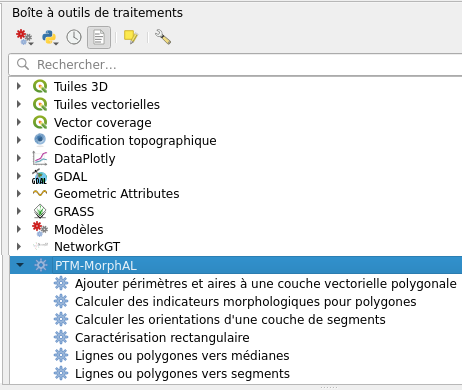

# Installation

MorphAL est disponible sous forme d'extension QGIS, déposée dans le répertoire officiel des extensions :<br/>
[https://plugins.qgis.org/plugins/morphal/](https://plugins.qgis.org/plugins/morphal/){target="_blank"}

De fait, l'installation de MorphAL peut être réalisée directement à partir du ```Gestionnaire d'extensions```. Pour ce faire, cliquez dans un premier temps sur le menu ```Extensions ► Installer/Gérer les extensions```. Dans la fenêtre qui s'ouvre, tapez MorphAL dans la barre de recherche puis cliquez sur ```Installer l'extension```. Si vous souhaitez en savoir plus sur l'installation des extensions QGIS, une page d'aide est disponible [ici](https://docs.qgis.org/3.40/fr/docs/training_manual/qgis_plugins/fetching_plugins.html){target="_blank"}.

Une fois l'installation de l'extension terminée, de nouveaux traitements sont maintenant accessibles dans la Boîte à outils de traitements, sous l'intitulé PTM-MorphAL.

<figure markdown>
  { .image-center loading=lazy }
  <figcaption>Menu MorphAL dans la Boîte à outils de traitements</figcaption>
</figure>
