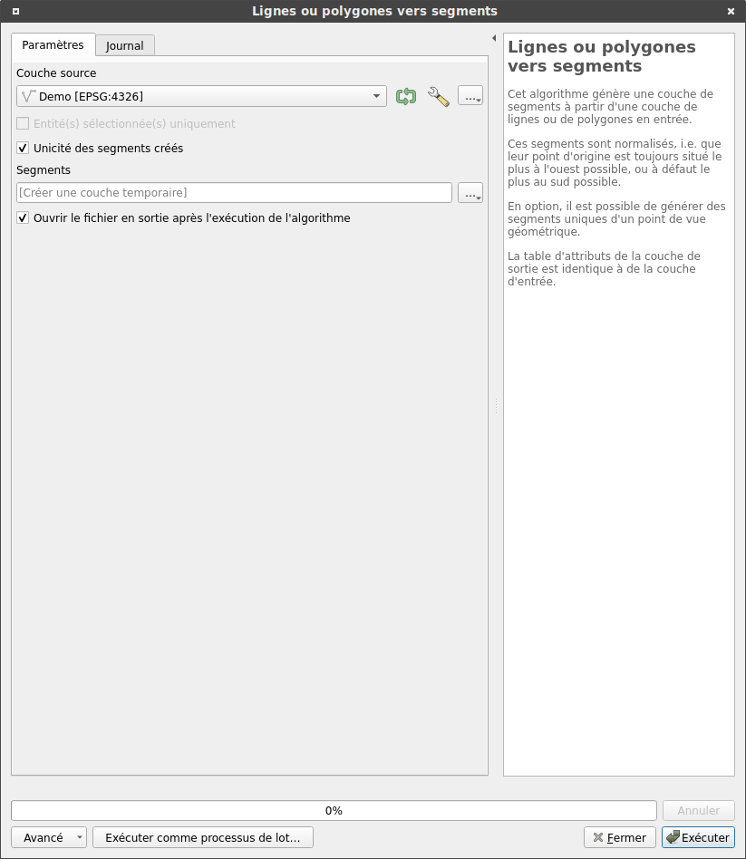
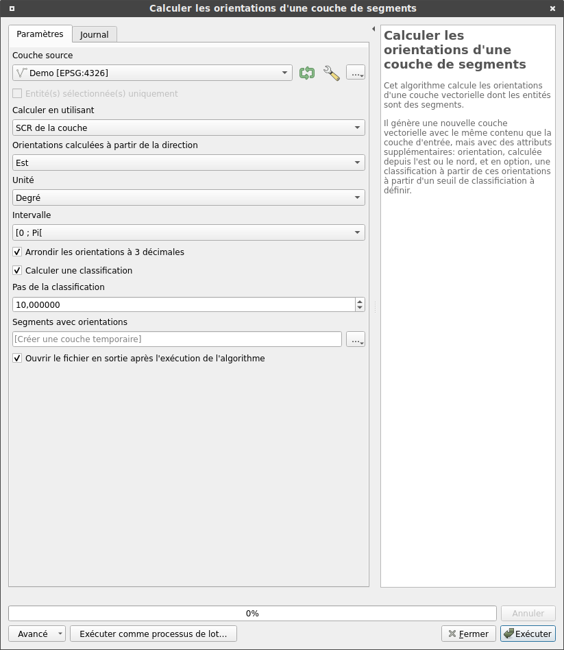
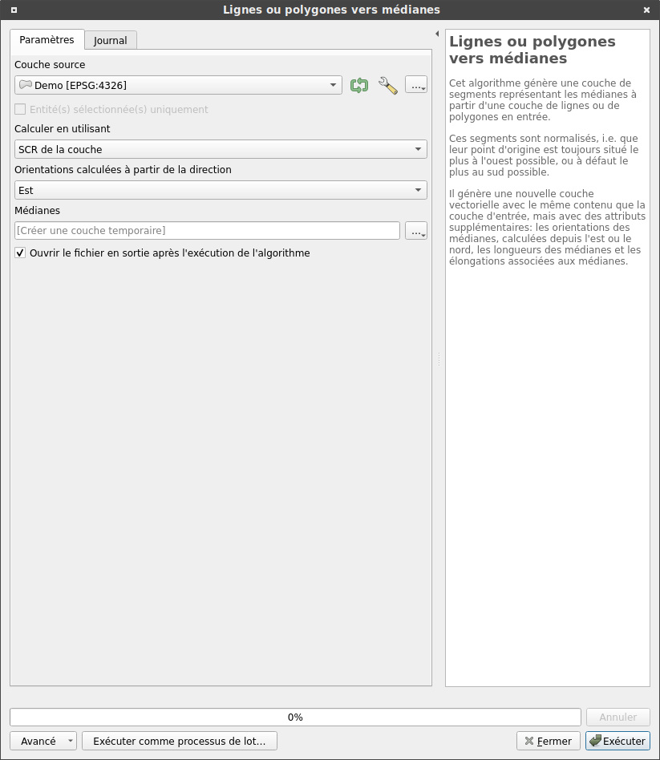
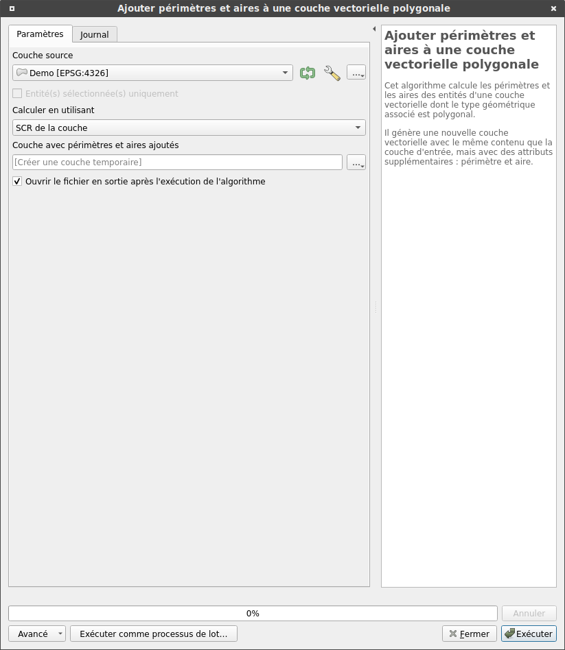
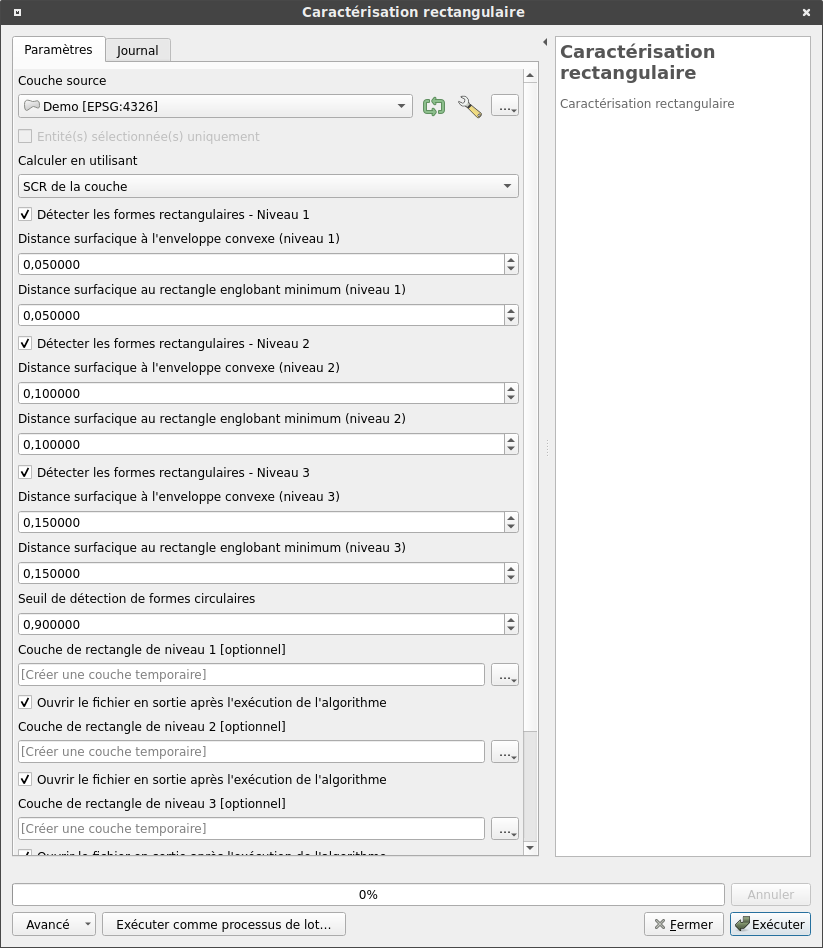
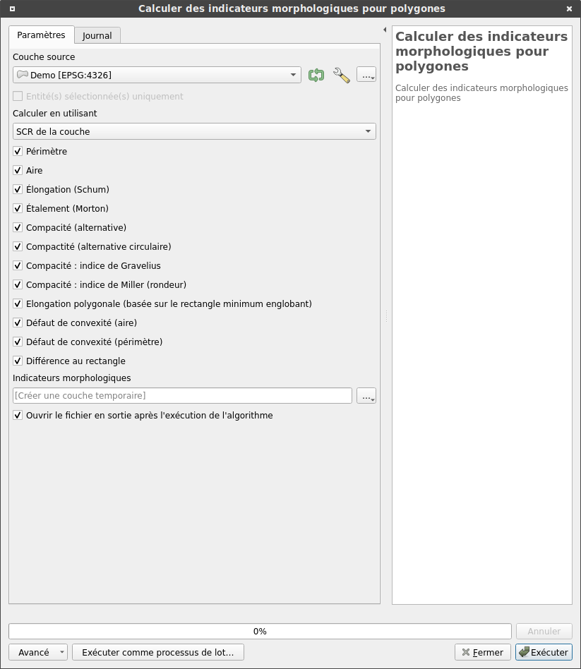

---
hide:
  - navigation
---

# Traitements

L'ensemble des traitements disponibles est ici décrit. Pour lancer l'un de ses traitements, cliquez sur le menu correspondant, dont le nom est indiqué à chaque début de
description.

### Lignes ou polygones vers segments

Cet algorithme génère une couche de segments à partir d'une couche de lignes ou de polygones en entrée. Ces segments sont normalisés, i.e. que leur point d'origine est toujours situé le plus à l'ouest possible, ou à défaut le plus au sud possible.

En option, il est possible de générer des segments uniques d'un point de vue géométrique.

La table d'attributs de la couche de sortie est identique à celle de la couche d'entrée.

<figure markdown>
  { .image-center width=60% loading=lazy }
  <!-- <figcaption>Lignes ou polygones vers segments</figcaption> -->
</figure>

#### Paramètres

| ID | Description | Type | Info | Obligatoire | Options |
|:-:|:-:|:-:|:-:|:-:|:-:|
|INPUT_LAYER|Couche source|QgsVectorLayer|Couche linéaire ou polygonale|✓||
|UNICITY|Unicité des segments créés|Booléen|Choix relatif à l'unicité des segments en sortie|✓|Par défaut : vrai. Sinon faux.|
|OUTPUT_LAYER|Segments|String|Chemin du fichier dans lequel la couche résultante sera enregistrée. Si non spécifié, une couche temporaire sera créée.||Par défaut : une couche temporaire est créée.|

#### Éléments en sortie

| ID | Description | Type | Info |
|:-:|:-:|:-:|:-:|
|OUTPUT_LAYER|Couche avec une géométrie linéaire|QgsVectorLayer|Cette couche est composée de segments normalisés, uniques ou non. Elle est soit créée temporairement soit enregistrée dans le fichier choisi en entrée.|

------

### Calculer les orientations d'une couche de segments

Cet algorithme calcule les orientations d'une couche vectorielle dont les entités sont des segments.

Il génère une nouvelle couche vectorielle avec le même contenu que la couche d'entrée, mais avec des attributs supplémentaires: orientation, calculée depuis l'est ou le nord, et en option, une classification à partir de ces orientations à partir d'un seuil de classificiation à définir.

<figure markdown>
  { .image-center width=60% loading=lazy }
  <!-- <figcaption>Calculer les orientations d'une couche de segments</figcaption> -->
</figure>

#### Paramètres

| ID | Description | Type | Info | Obligatoire | Options |
|:-:|:-:|:-:|:-:|:-:|:-:|
|INPUT|Couche source|QgsVectorLayer|Couche de segments|✓||
|CALC_METHOD|Calculer en utilisant|Énumération|Choix du système de projection dans lequel le calcul des orientations sera effectué|✓|Par défaut : SCR (Système de Coordonnées de Référence) de la couche. Sinon, SCR du projet en cours ou Ellipsoïdale.|
|ORIENTATION_ORIGIN|Orientations calculées à partir de la direction|Énumération|Choix de l'origine avec laquelle le calcul des orientations sera effectué|✓|Par défaut : orientation Est (champ résultant : E_ORIENTATION). Sinon, orientation Nord (champ résultant : N_ORIENTATION).|
|UNIT|Unité|Énumération|Choix de l'unité avec laquelle le calcul des orientations sera effectué|✓|Par défaut : Degré. Sinon, Radian ou Grade.|
|INTERVAL|Intervalle|Énumération|Choix de l'intervalle avec lequel le calcul des orientations sera effectué|✓|Par défaut : $\mathopen[0;\pi\mathclose[$. Sinon, $\mathopen[0;\frac{\pi}{2}\mathclose[$.|
|ROUNDED|Arrondir les orientations à 3 décimales|Booléen|Arrondir ou non les orientations calculées|✓|Par défaut : vrai. Sinon faux.|
|CLASSIFICATION|Créer une classification des orientations|Booléen|Arrondir ou non les orientations calculées|✓|Par défaut : vrai (champ résultant : E_CLASSIFICATION si l'orientation est à l'Est, N_CLASSIFICATION si l'orientation est au Nord). Sinon faux.|
|CLASSIFICATION_STEP|Pas de la classification|Nombre|Pas utilisé afin de créer les classes des orientations|✓|Par défaut : 10.0.|
|OUTPUT|Segments avec orientations|String|Chemin du fichier dans lequel la couche résultante sera enregistrée. Si non spécifié, une couche temporaire sera créée.||Par défaut : une couche temporaire est créée.|

#### Éléments en sortie

| ID | Description | Type | Info |
|:-:|:-:|:-:|:-:|
|OUTPUT|Couche avec une géométrie linéaire|QgsVectorLayer|Cette couche est composée de segments normalisés, uniques ou non. Elle est soit créée temporairement soit enregistrée dans le fichier choisi en entrée. Un champ lié à l'orientation a été ajouté, soit E_ORIENTATION (orientation depuis l'Est) soit N_ORIENTATION (orientation depuis le Nord). Un champ lié à la classification a également été ajouté si demandé, soit E_CLASSIFICATION soit N_CLASSIFICATION.|

------

### Lignes ou polygones vers médianes

Cet algorithme génère une couche de segments représentant les médianes à partir d'une couche de lignes ou de polygones en entrée.

Ces segments sont normalisés, i.e. que leur point d'origine est toujours situé le plus à l'ouest possible, ou à défaut le plus au sud possible.

Il génère une nouvelle couche vectorielle avec le même contenu que la couche d'entrée, mais avec des attributs supplémentaires: les orientations des médianes, calculées depuis l'est ou le nord, les longueurs des médianes et les élongations associées aux médianes.

<figure markdown>
  { .image-center width=60% loading=lazy }
  <!-- <figcaption>Lignes ou polygones vers médianes</figcaption> -->
</figure>

#### Paramètres

| ID | Description | Type | Info | Obligatoire | Options |
|:-:|:-:|:-:|:-:|:-:|:-:|
|INPUT_LAYER|Couche source|QgsVectorLayer|Couche linéaire ou polygonale|✓||
|CALC_METHOD|Calculer en utilisant|Énumération|Choix du système de projection dans lequel le calcul des orientations sera effectué|✓|Par défaut : SCR (Système de Coordonnées de Référence) de la couche. Sinon, SCR du projet en cours ou Ellipsoïdale.|
|ORIENTATION_ORIGIN|Orientations calculées à partir de la direction|Énumération|Choix de l'origine avec laquelle le calcul des orientations des médianes sera effectué. Les orientations sont calculés en degrés|✓|Par défaut : orientation Est (champ résultant : E_ORIENTATION). Sinon, orientation Nord (champ résultant : N_ORIENTATION).|
|OUTPUT|Médianes|String|Chemin du fichier dans lequel la couche résultante sera enregistrée. Si non spécifié, une couche temporaire sera créée.||Par défaut : une couche temporaire est créée.|

#### Éléments en sortie

| ID | Description | Type | Info |
|:-:|:-:|:-:|:-:|
|OUTPUT|Couche avec une géométrie linéaire|QgsVectorLayer|Cette couche est composée de segments normalisés, uniques ou non, représentant les médianes associées aux géométries de la couche source. Elle est soit créée temporairement soit enregistrée dans le fichier choisi en entrée. Un champ lié à l'orientation a été ajouté, soit E_ORIENTATION (orientation depuis l'Est) soit N_ORIENTATION (orientation depuis le Nord). Un champ LENGTH est ajouté, représentant la longueur de la médiane, ainsi qu'un champ ELONGATION, étant le rapport entre la longueur et la largeur du rectangle minimim englobant de la géométrie associée. Si ce dernier ne peut être défini, la valeur du champ ELONGATION est égale à -1.|

------

### Ajouter périmètres et aires à une couche vectorielle polygonale

Cet algorithme calcule les périmètres et les aires des entités d'une couche vectorielle dont le type géométrique associé est polygonal.

Il génère une nouvelle couche vectorielle avec le même contenu que la couche d'entrée, mais avec deux champs attributaires supplémentaires : périmètre et aire.

<figure markdown>
  { .image-center width=60% loading=lazy }
  <!-- <figcaption>Ajouter périmètres et aires à une couche vectorielle polygonale</figcaption> -->
</figure>

#### Paramètres

| ID | Description | Type | Info | Obligatoire | Options |
|:-:|:-:|:-:|:-:|:-:|:-:|
|INPUT|Couche source|QgsVectorLayer|Couche polygonale|✓||
|CALC_METHOD|Calculer en utilisant|Énumération|Choix du système de projection dans lequel le calcul des périmètres et des aires sera effectué|✓|Par défaut : SCR (Système de Coordonnées de Référence) de la couche. Sinon, SCR du projet en cours ou Ellipsoïdale.|
|OUTPUT|Couche avec périmètres et aires ajoutés|String|Chemin du fichier dans lequel la couche résultante sera enregistrée. Si non spécifié, une couche temporaire sera créée.||Par défaut : une couche temporaire est créée.|

#### Éléments en sortie

| ID | Description | Type | Info |
|:-:|:-:|:-:|:-:|
|OUTPUT|Couche avec une géométrie polygonale|QgsVectorLayer|Cette couche ajoute à la couche source les champs attributaires supplémentaires PERIMETER et AREA, représentant respectivement le périmètre et l'aire de la géométrie associée. La couche est soit créée temporairement soit enregistrée dans le fichier choisi en entrée.|

------

### Caractérisation rectangulaire

Cet algorithme permet, à partir d'une couche source polygonale, de réaliser une analyse morphologique permettant de caractériser des formes rectangulaires, et en parallèle, de caractériser des formes circulaires.

La caractérisation rectangulaire repose sur une combinaison de deux indices :

- le premier indice est défini comme étant la distance surfacique du polygone considéré et de son plus petit rectangle englobant,
- le second indice est défini comme étant la distance surfacique du polygone considéré et de son enveloppe convexe,
- avec la distance surfacique $d_s$ étant défini comme suit en lien avec deux polygones, $A$ et $B$ :
$$ d_s = \frac{Aire(A \Delta B)}{Aire(A \cup B)}$$
avec $A \Delta B$ étant la différence symétrique entre les polygones $A$ et $B$, et $A \cup B$ étant l'union entre $A$ et $B$.

La distance distance admet des valeurs comprises dans l'intervalle [0,1], avec 1 si les deux objets sont totalement disjoints, et 0 si les deux objets sont identiques.

La caractérisation rectangulaire peut possiblement être réalisée à l'aide trois niveaux de formes rectangulaires, la détection à partir un niveau unique étant apparu comme relativement limitée.

La caractérisation circulaire repose quant à elle sur l'indice de Miller ($I_{Miller}$), avec un seuil fixé par défaut à 0.9 :
$$ I_{Miller} = \frac{4\pi \times Aire}{Périmètre^2} $$

<figure markdown>
  { .image-center width=60% loading=lazy }
  <!-- <figcaption>Caractérisation rectangulaire</figcaption> -->
</figure>

#### Paramètres

| ID | Description | Type | Info | Obligatoire | Options |
|:-:|:-:|:-:|:-:|:-:|:-:|
|INPUT_LAYER|Couche source|QgsVectorLayer|Couche polygonale|✓||
|CALC_METHOD|Calculer en utilisant|Énumération|Choix du système de projection dans lequel l'ensemble des calculs sera effectué|✓|Par défaut : SCR (Système de Coordonnées de Référence) de la couche. Sinon, SCR du projet en cours ou Ellipsoïdale.|
|RECTANGLE_LEVEL_1|Détecter les formes rectangulaires - Niveau 1|Booléen|Champs ajoutés : SD_CONVEX, SD_MBR, ORIENT_REC et ELONGATION.|✓|Par défaut : vrai. Sinon faux|
|SD_CONVEX_RECT_1|Distance surfacique à l'enveloppe convexe (niveau 1)|Nombre||✓|Par défaut : 0.05. Valeur minimale : 0. Valeur maximale : 1.|
|SD_MBR_RECT_1|Distance surfacique au rectangle englobant minimum (niveau 1)|Nombre||✓|Par défaut : 0.05. Valeur minimale : 0. Valeur maximale : 1.|
|RECTANGLE_LEVEL_2|Détecter les formes rectangulaires - Niveau 2|Booléen|Champs ajoutés : SD_CONVEX, SD_MBR, ORIENT_REC et ELONGATION.|✓|Par défaut : vrai. Sinon faux|
|SD_CONVEX_RECT_2|Distance surfacique à l'enveloppe convexe (niveau 2)|Nombre||✓|Par défaut : 0.1. Valeur minimale : 0. Valeur maximale : 1.|
|SD_MBR_RECT_2|Distance surfacique au rectangle englobant minimum (niveau 2)|Nombre||✓|Par défaut : 0.1. Valeur minimale : 0. Valeur maximale : 1.|
|RECTANGLE_LEVEL_3|Détecter les formes rectangulaires - Niveau 3|Booléen|Champs ajoutés : SD_CONVEX, SD_MBR, ORIENT_REC et ELONGATION.|✓|Par défaut : vrai. Sinon faux|
|SD_CONVEX_RECT_3|Distance surfacique à l'enveloppe convexe (niveau 3)|Nombre||✓|Par défaut : 0.15. Valeur minimale : 0. Valeur maximale : 1.|
|SD_MBR_RECT_3|Distance surfacique au rectangle englobant minimum (niveau 3)|Nombre||✓|Par défaut : 0.15. Valeur minimale : 0. Valeur maximale : 1.|
|MILLER_INDEX|Seuil de détection de formes circulaires|Nombre|Champ ajouté : MILLER_IND.|✓|Par défaut : 0.9. Valeur minimale : 0. Valeur maximale : 1.|
|RECT_1_LAYER_OUTPUT|Couche de rectangle de niveau 1|String|Chemin du fichier dans lequel la couche résultante sera enregistrée. Si non spécifié, une couche temporaire sera créée.||Par défaut : une couche temporaire est créée.|
|RECT_2_LAYER_OUTPUT|Couche de rectangle de niveau 2|String|Chemin du fichier dans lequel la couche résultante sera enregistrée. Si non spécifié, une couche temporaire sera créée.||Par défaut : une couche temporaire est créée.|
|RECT_3_LAYER_OUTPUT|Couche de rectangle de niveau 3|String|Chemin du fichier dans lequel la couche résultante sera enregistrée. Si non spécifié, une couche temporaire sera créée.||Par défaut : une couche temporaire est créée.|
|RECT_ALL_INDICATORS_LAYER_OUTPUT|Couche de sortie avec l'ensemble  des indicateurs de rectangularité|String|Chemin du fichier dans lequel la couche résultante sera enregistrée. Si non spécifié, une couche temporaire sera créée.||Par défaut : une couche temporaire est créée.|

#### Éléments en sortie

| ID | Description | Type | Info |
|:-:|:-:|:-:|:-:|

------

### Calculer des indicateurs morphologiques pour polygones

Cet algorithme calcul de nombreux indicateurs morphologiques en lien avec une couche polygonale.

L'ensemble des indices est défini à la suite des tableaux ci-dessous.

<figure markdown>
  { .image-center width=60% loading=lazy }
  <!-- <figcaption>Calculer des indicateurs morphologiques pour polygones</figcaption> -->
</figure>

#### Paramètres

| ID | Description | Type | Info | Obligatoire | Options |
|:-:|:-:|:-:|:-:|:-:|:-:|
|INPUT_LAYER|Couche source|QgsVectorLayer|Couche polygonale|✓||
|CALC_METHOD|Calculer en utilisant|Énumération|Choix du système de projection dans lequel le calcul des périmètres et des aires sera effectué|✓|Par défaut : SCR (Système de Coordonnées de Référence) de la couche. Sinon, SCR du projet en cours ou Ellipsoïdale.|
|PERIMETER|Périmètre|Booléen|Champ ajouté : PERIMETER.|✓|Par défaut : vrai. Sinon faux|
|AREA|Aire|Booléen|Champ ajouté : AREA.|✓|Par défaut : vrai. Sinon faux|
|SCHUM_ELONGATION|Élongation (Schum)|Booléen|Champ ajouté : SCHUM.|✓|Par défaut : vrai. Sinon faux|
|MORTON_INDEX|Étalement (Morton)|Booléen|Champ ajouté : MORTON.|✓|Par défaut : vrai. Sinon faux|
|ALTERNATIVE_COMPACITY|Compacité (alternative)|Booléen|Champ ajouté : ALT_COMP.|✓|Par défaut : vrai. Sinon faux|
|ALTERNATIVE_CIRCLE_COMPACITY|Compacité (alternative circulaire)|Booléen|Champ ajouté : ALT_C_COMP.|✓|Par défaut : vrai. Sinon faux|
|GRAVELIUS_INDEX|Compacité : indice de Gravelius|Booléen|Champ ajouté : GRAVELIUS.|✓|Par défaut : vrai. Sinon faux|
|MILLER_INDEX|Compacité : indice de Miller (rondeur)|Booléen|Champ ajouté : MILLER.|✓|Par défaut : vrai. Sinon faux|
|ELONGATION|Élongation polygonale (basée sur le rectangle minimum englobant)|Booléen|Champ ajouté : ELONGATION.|✓|Par défaut : vrai. Sinon faux|
|AREA_CONV_DEFECT|Défaut de convexité (aire)|Booléen|Champ ajouté : A_CONV_DEF.|✓|Par défaut : vrai. Sinon faux|
|PERIMETER_CONV_DEFECT|Défaut de convexité (périmètre)|Booléen|Champ ajouté : P_CONV_DEF.|✓|Par défaut : vrai. Sinon faux|
|RECTANGULAR_DIFFERENCE|Différence au rectangle|Booléen|Champ ajouté : RECT_DIFF.|✓|Par défaut : vrai. Sinon faux|
|OUTPUT_LAYER|Indices morphologiques|String|Chemin du fichier dans lequel la couche résultante sera enregistrée. Si non spécifié, une couche temporaire sera créée.||Par défaut : une couche temporaire est créée.|

#### Éléments en sortie

| ID | Description | Type | Info |
|:-:|:-:|:-:|:-:|
|OUTPUT_LAYER|Couche avec une géométrie polygonale|QgsVectorLayer|Cette couche ajoute à la couche source les champs attributaires supplémentaires sélectionnés. La couche est soit créée temporairement soit enregistrée dans le fichier choisi en entrée.|

#### Définitions des différents indicateurs

- Élongation (Schum) :
$$ Elongation_{Schum} = \frac{\sqrt{Aire}}{distance_{max} \times \sqrt{\pi}} $$
avec $distance_{max}$ étant la distance du plus grand axe du polygone.

Cet indicateur est compris dans l'intervalle $\mathopen[0;0.5\mathclose]$.

- Étalement (Morton) :
$$ Etalement_{Morton} = \frac{4 \times Aire}{distance_{max}^2 \times \pi} $$

Cet indicateur est compris dans l'intervalle $\mathopen[0;1\mathclose]$.

- Compacité (alternative) :
$$ Compacité = \frac{Périmètre^2}{Aire} $$

- Compacité (alternative circulaire) :
$$ Compacité = \frac{Aire}{\pi \times (\frac{distance_{max}}{2})^2} $$

Cet indicateur est compris dans l'intervalle $\mathopen[0;1\mathclose]$.

- Compacité, indice de Gravelius :
$$ Compacité_{Gravelius} = \frac{Périmètre}{2 \times \sqrt{\pi \times Aire}} $$

Cet indicateur est supérieur ou égal à 1.

- Compacité, indice de Miller (rondeur) :
$$ I_{Miller} = \frac{4\pi \times Aire}{Périmètre^2} $$

Cet indicateur est compris dans l'intervalle $\mathopen[0;1\mathclose]$.

- Élongation polygonale (basée sur le rectangle minimum englobant) :
$$ Elongation = \frac{Longueur_{RME}}{Largeur_{RME}} $$

avec $Longueur_{RME}$ et Largeur_{RME} étant respectivement la longueur et la largeur du rectangle minimum englobant.

Cet indicateur est supérieur ou égal à 1.

- Défaut de convexité (aire) :
$$ Défaut_{convexité}-aire = \frac{Aire}{Aire_{convexe}} $$
avec $Aire$ et $Aire_{convexe}$ étant respectivement les aires du polygone et de la surface convexe associée à ce polygone.

Cet indicateur est compris dans l'intervalle $\mathopen[0;1\mathclose]$.

- Défaut de convexité (périmètre) :
$$ Défaut_{convexité}-périmètre = \frac{Périmètre_{convexe}}{Périmètre} $$
avec $Périmètre$ et $Périmètre_{convexe}$ étant respectivement les périmètres du polygone et de la surface convexe associée à ce polygone.

Cet indicateur est compris dans l'intervalle $\mathopen[0;1\mathclose]$.

- Différence au rectangle :
$$ Différence_{RME} = \frac{Aire}{Aire_{RME}} $$

avec $Aire$ et $Aire_{RME}$ étant respectivement les aires du polygone et du rectangle minimum englobant.

Cet indicateur est compris dans l'intervalle $\mathopen[0;1\mathclose]$.
